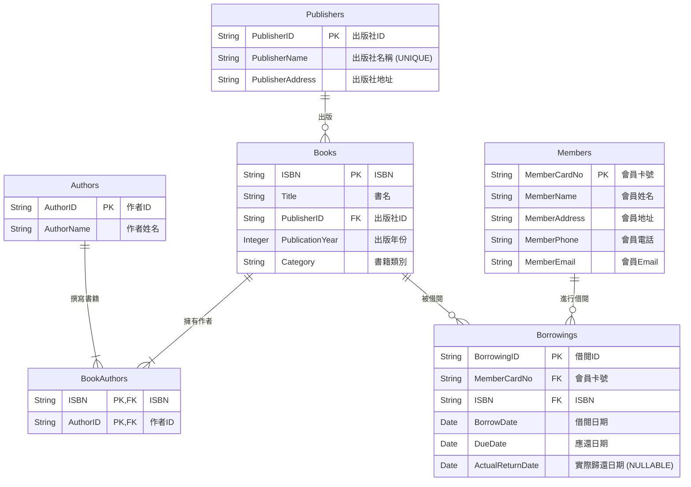

## GAI 工具使用說明及操作過程

**操作過程概述：**

1.  **情境理解與需求分析(Input Analysis)**：向 GAI 工具提供每個 Lab 的情境描述、原始資料欄位以及具體任務要求。
2.  **初步資料審查(Initial Data Review)**：GAI 分析原始資料，找出潛在的重複、多值屬性等問題。
3.  **函數相依性推導(Functional Dependency Derivation)**：GAI 基於資料屬性間的語義關係，列出所有合理的函數相依性。
4.  **正規化執行(Normalization Execution)**：
    - **UNF -> 1NF**：GAI 協助識別並消除多值屬性與重複群組，確保欄位原子性，並建立必要的關聯資料表。
    - **1NF -> 2NF**：GAI 協助檢查是否存在部分相依性(尤其在有複合主鍵的情況下)，並進行分解。
    - **2NF -> 3NF**：GAI 協助識別並消除遞移相依性，將非鍵屬性間的相依關係分解到新的資料表中。
    - **3NF -> BCNF**：GAI 協助檢查每個決定因素是否為候選鍵，以達到 BCNF。若有衝突或過度分解的疑慮，則進行討論。
5.  **綱要設計與 ERD 概念生成(Schema Design & ERD Conception)**：GAI 根據正規化結果，產生最終的資料表綱要，並描述實體關係圖(ERD)的結構與關係。ERD 圖使用 Mermaid 語法繪製。
6.  **SQL DDL 語句生成 (SQL DDL Generation)**：針對 Lab-05_3，GAI 根據最終綱要產生 MariaDB 的 `CREATE TABLE` 語句。 (此步驟在此 Lab 中不適用或已移除)
7.  **分析與解釋撰寫 (Analysis and Explanation Writing)**：GAI 協助整理正規化過程的每個步驟、理由、遇到的挑戰及設計決策，形成文字說明。

---

## Lab-05_1：圖書館資料庫設計

### 情境

為圖書館設計資料庫，需要追蹤書籍、會員以及借閱記錄。

**資料基本包含：**

- **書籍**：ISBN、書名、作者 (可能多位)、出版社名稱、出版社地址、出版年份、書籍類別。
- **會員**：會員卡號、會員姓名、會員地址、會員電話、會員 Email。
- **借閱**：會員卡號、會員姓名、ISBN、書名、借閱日期、應還日期、實際歸還日期。

---

### 任務

1.  **識別問題與函數相依性**：分析潛在的資料重複、插入異常、更新異常和刪除異常。列出所有合理的函數相依性。
2.  **正規化設計**：將資料庫綱要(Schema)正規化至第三正規化(3NF)。如果可以，嘗試達到 BCNF。
3.  **繪製最終的實體關係圖(ERD)**。
4.  **分析與說明**：簡要說明正規化過程，以及每個步驟的理由。

---

### 函數相依性列表

1.  **書籍相關：**

    - `ISBN` → `書名`, `出版社名稱`, `出版社地址`, `出版年份`, `書籍類別`
    - `出版社名稱` → `出版社地址` (遞移相依)
    - (隱含多值) `ISBN` ↔ `作者` (一本書可有多個作者，一個作者可寫多本書)

2.  **會員相關：**

    - `會員卡號` → `會員姓名`, `會員地址`, `會員電話`, `會員Email`

3.  **借閱相關：**
    - 假設新增代理鍵 `借閱ID`: `借閱ID` → `會員卡號`, `ISBN`, `借閱日期`, `應還日期`, `實際歸還日期`
    - (或無代理鍵): (`會員卡號`, `ISBN`, `借閱日期`) → `應還日期`, `實際歸還日期`
    - `會員卡號` → `會員姓名` (在原始借閱資料中多餘)
    - `ISBN` → `書名` (在原始借閱資料中多餘)

---

### 正規化步驟 (至 3NF/BCNF)

**Step 0: 原始扁平化資料 (概念)**

初步收集的資料可能像以下幾個未正規化的表格：

- **`原始書籍資料`**: `ISBN`, `書名`, `作者1`, `作者2`, ..., `出版社名稱`, `出版社地址`, `出版年份`, `書籍類別` (問題：作者為重複群組/多值屬性；出版社資訊重複)
- **`原始會員資料`**: `會員卡號`, `會員姓名`, `會員地址`, `會員電話`, `會員Email` (相對乾淨，但需確認原子性)
- **`原始借閱資料`**: `會員卡號`, `會員姓名`, `ISBN`, `書名`, `借閱日期`, `應還日期`, `實際歸還日期` (問題：會員姓名和書名冗餘)

**Step 1: 轉換至 1NF (消除重複群組與多值屬性)**

- **處理書籍中的多值「作者」屬性：**

  - **`書籍_1NF (Books_1NF)`**: `ISBN` (PK), `書名`, `出版社名稱`, `出版社地址`, `出版年份`, `書籍類別`
  - **`作者_1NF (Authors_1NF)`**: `作者ID` (PK, 新增代理鍵), `作者姓名`
  - **`書籍作者對應_1NF (BookAuthors_1NF)`**: `ISBN` (PK, FK), `作者ID` (PK, FK)
    - _此表用於表示書籍和作者之間的多對多關係。_

- **會員資料 (已接近 1NF)：**

  - **`會員_1NF (Members_1NF)`**: `會員卡號` (PK), `會員姓名`, `會員地址`, `會員電話`, `會員Email`
    - _確保所有欄位都是原子性的。_

- **借閱資料 (處理明顯冗餘，並確保主鍵)：**
  - **`借閱_1NF (Borrowings_1NF)`**: `借閱ID` (PK, 新增代理鍵), `會員卡號`, `會員姓名`, `ISBN`, `書名`, `借閱日期`, `應還日期`, `實際歸還日期`
    - _引入代理鍵 `借閱ID` 簡化主鍵。會員姓名和書名在此階段暫時保留，將在後續正規化步驟中處理。_

**Step 2: 轉換至 2NF (消除部分相依)**

- **`書籍_1NF`**: 主鍵為 `ISBN` (單一屬性)，無部分相依問題，已在 2NF。
- **`作者_1NF`**: 主鍵為 `作者ID` (單一屬性)，無部分相依問題，已在 2NF。
- **`書籍作者對應_1NF`**: 複合主鍵 (`ISBN`, `作者ID`)。此表沒有其他非鍵屬性，因此不存在部分相依問題，已在 2NF。
- **`會員_1NF`**: 主鍵為 `會員卡號` (單一屬性)，無部分相依問題，已在 2NF。
- **`借閱_1NF`**: 主鍵為 `借閱ID` (單一屬性)，無部分相依問題，已在 2NF。

  _在此階段，所有表都已滿足 2NF 的要求，因為非鍵屬性都完全依賴於它們各自表的主鍵。_

**Step 3: 轉換至 3NF (消除遞移相依與其他冗餘)**

- **處理 `書籍_1NF` 中的遞移相依：**

  - 在 `書籍_1NF` 中：`ISBN` → `出版社名稱`，且 `出版社名稱` → `出版社地址`。
  - 這是一個遞移相依 (`ISBN` → `出版社名稱` → `出版社地址`)。
  - 分解出 `出版社` 表：
    - **`出版社 (Publishers)`**: `出版社ID` (PK, 新增代理鍵), `出版社名稱` (UNIQUE), `出版社地址`
    - **`書籍 (Books)`**: `ISBN` (PK), `書名`, `出版社ID` (FK references `Publishers`), `出版年份`, `書籍類別`

- **處理 `借閱_1NF` 中的冗餘資訊 (由外鍵決定的屬性)：**

  - 在 `借閱_1NF` 中：
    - `會員姓名` 可由 `會員卡號` (FK) 從 `會員` 表查到。(`借閱ID` → `會員卡號` → `會員姓名`)
    - `書名` 可由 `ISBN` (FK) 從 `書籍` 表查到。(`借閱ID` → `ISBN` → `書名`)
  - 移除這些冗餘屬性：
    - **`借閱記錄 (Borrowings)`**: `借閱ID` (PK), `會員卡號` (FK references `Members`), `ISBN` (FK references `Books`), `借閱日期`, `應還日期`, `實際歸還日期`

- **其他表保持不變，已是 3NF：**
  - **`作者 (Authors)`**: `作者ID` (PK), `作者姓名`
  - **`書籍作者對應 (BookAuthors)`**: `ISBN` (PK, FK), `作者ID` (PK, FK)
  - **`會員 (Members)`**: `會員卡號` (PK), `會員姓名`, `會員地址`, `會員電話`, `會員Email`

**最終正規化後的資料表 (3NF/BCNF)：**

1.  **`出版社 (Publishers)`**

    - **`出版社ID` (PK)**
    - `出版社名稱` (UNIQUE, NOT NULL)
    - `出版社地址`
    - _FD: `出版社ID` → `出版社名稱`, `出版社地址`_
    - _FD: `出版社名稱` → `出版社ID`, `出版社地址` (若出版社名稱為候選鍵)_

2.  **`書籍 (Books)`**

    - **`ISBN` (PK)**
    - `書名`
    - `出版社ID` (FK, References `Publishers(出版社ID)`)
    - `出版年份`
    - `書籍類別`
    - _FD: `ISBN` → `書名`, `出版社ID`, `出版年份`, `書籍類別`_

3.  **`作者 (Authors)`**

    - **`作者ID` (PK)**
    - `作者姓名`
    - _FD: `作者ID` → `作者姓名`_

4.  **`書籍作者 (BookAuthors)`** (處理書籍與作者的多對多關係)

    - **`ISBN` (PK, FK, References `Books(ISBN)`)**
    - **`作者ID` (PK, FK, References `Authors(作者ID)`)**
    - _FD: (`ISBN`, `作者ID`) → {} (沒有非鍵屬性)_

5.  **`會員 (Members)`**

    - **`會員卡號` (PK)**
    - `會員姓名`
    - `會員地址`
    - `會員電話`
    - `會員Email`
    - _FD: `會員卡號` → `會員姓名`, `會員地址`, `會員電話`, `會員Email`_

6.  **`借閱記錄 (Borrowings)`**
    - **`借閱ID` (PK, 代理鍵)**
    - `會員卡號` (FK, References `Members(會員卡號)`)
    - `ISBN` (FK, References `Books(ISBN)`)
    - `借閱日期`
    - `應還日期`
    - `實際歸還日期` (NULLABLE)
    - _FD: `借閱ID` → `會員卡號`, `ISBN`, `借閱日期`, `應還日期`, `實際歸還日期`_

上述所有表均已達到 BCNF，因為每個表中的每個非平凡函數相依性 `X → Y`，`X` 都是該表的超鍵。

---

### 最終的實體關係圖 (ERD)

