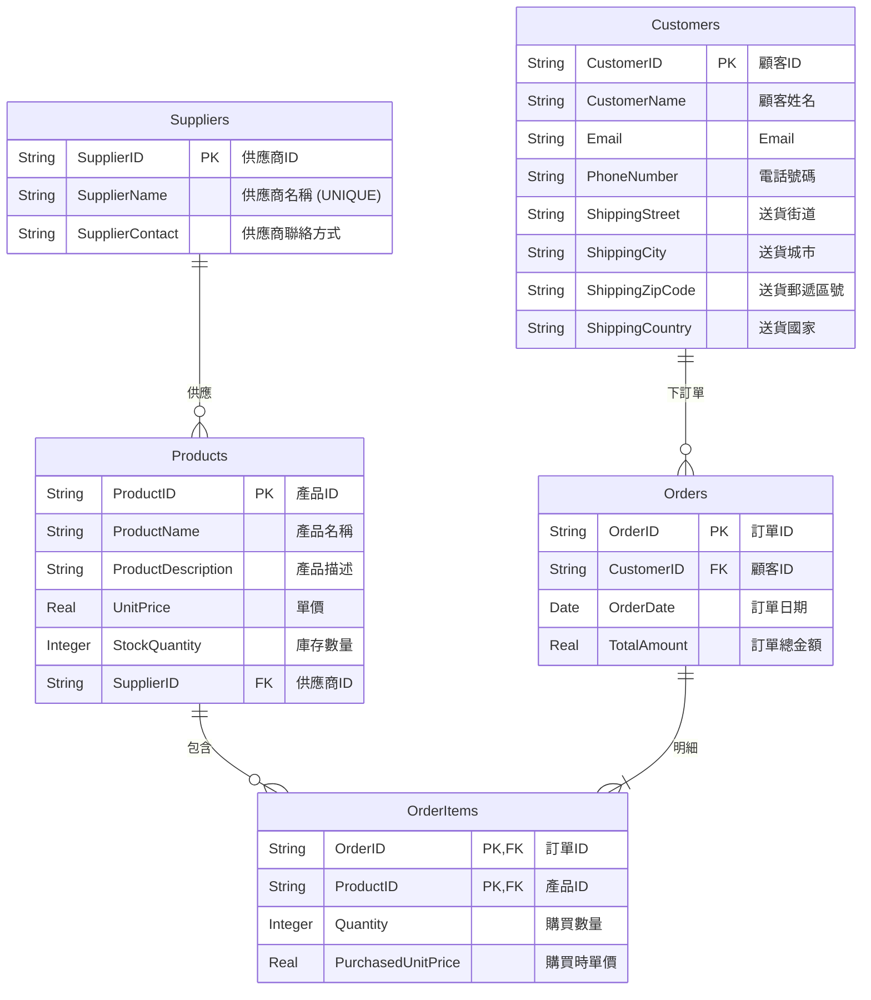

## GAI 工具使用說明及操作過程

**操作過程概述：**

1.  **情境理解與需求分析(Input Analysis)**：向 GAI 工具提供每個 Lab 的情境描述、原始資料欄位以及具體任務要求。
2.  **初步資料審查(Initial Data Review)**：GAI 分析原始資料，找出潛在的重複、多值屬性等問題。
3.  **函數相依性推導(Functional Dependency Derivation)**：GAI 基於資料屬性間的語義關係，列出所有合理的函數相依性。
4.  **正規化執行(Normalization Execution)**：
    - **UNF -> 1NF**：GAI 協助識別並消除多值屬性與重複群組，確保欄位原子性，並建立必要的關聯資料表。
    - **1NF -> 2NF**：GAI 協助檢查是否存在部分相依性(尤其在有複合主鍵的情況下)，並進行分解。
    - **2NF -> 3NF**：GAI 協助識別並消除遞移相依性，將非鍵屬性間的相依關係分解到新的資料表中。
    - **3NF -> BCNF**：GAI 協助檢查每個決定因素是否為候選鍵，以達到 BCNF。若有衝突或過度分解的疑慮，則進行討論。
5.  **綱要設計與 ERD 概念生成(Schema Design & ERD Conception)**：GAI 根據正規化結果，產生最終的資料表綱要，並描述實體關係圖(ERD)的結構與關係。ERD 圖使用 Mermaid 語法繪製。
6.  **SQL DDL 語句生成 (SQL DDL Generation)**：針對 Lab-05_3，GAI 根據最終綱要產生 MariaDB 的 `CREATE TABLE` 語句。(此步驟在此 Lab 中不適用或已移除)
7.  **分析與解釋撰寫 (Analysis and Explanation Writing)**：GAI 協助整理正規化過程的每個步驟、理由、遇到的挑戰及設計決策，形成文字說明。

---

## Lab-05_2：線上商店訂單系統

### 情境

一家小型線上商店需要一個系統來管理顧客、產品和訂單。

**初步收集的資料可能包含：**

- **顧客**：顧客 ID、顧客姓名、Email、電話號碼、完整送貨地址 (街道、城市、郵遞區號、國家)。
- **產品**：產品 ID、產品名稱、產品描述、單價、庫存數量、供應商名稱、供應商聯絡方式。
- **訂單**：訂單 ID、顧客 ID、顧客姓名、訂單日期、訂單總金額、產品 ID (多個)、產品名稱 (多個)、購買數量 (對應每個產品)、單價 (對應每個產品)。

---

### 任務

1.  **分析與正規化**：從一個包含所有訂單資訊的單一扁平化表格概念開始。找出函數相依性。將綱要正規化至第三正規化 (3NF)。
2.  **分析與說明**：說明正規化步驟。

---

### 函數相依性列表

1.  **顧客相關：**

    - `顧客ID` → `顧客姓名`, `Email`, `電話號碼`, `送貨街道`, `送貨城市`, `送貨郵遞區號`, `送貨國家`

2.  **供應商相關 (假設 `供應商ID` 為新增代理鍵)：**

    - `供應商ID` → `供應商名稱`, `供應商聯絡方式`
    - `供應商名稱` → `供應商ID`, `供應商聯絡方式` (若 `供應商名稱` 唯一，可為候選鍵)

3.  **產品相關：**

    - `產品ID` → `產品名稱`, `產品描述`, `單價` (產品目前標準售價), `庫存數量`, `供應商ID` (FK)

4.  **訂單相關：**

    - `訂單ID` → `顧客ID` (FK), `訂單日期`, `訂單總金額`

5.  **訂單明細相關 (處理訂單中多個產品)：**

    - (`訂單ID`, `產品ID`) → `購買數量`, `購買時單價` (交易時的價格)

---

### 正規化步驟 (至 3NF)

**Step 0: 原始扁平化資料 (概念)**
單一表格包含所有顧客、產品、訂單資訊，其中產品資訊在每個訂單中為重複群組。

**Step 1: 轉換至 1NF (消除重複群組)**
將重複的產品資訊從訂單中移至新的 `OrderItems` 資料表。

- **`Customers_temp`**: `顧客ID` (PK), `顧客姓名`, `Email`, `電話號碼`, `送貨街道`, `送貨城市`, `送貨郵遞區號`, `送貨國家`
- **`Suppliers_temp`**: `供應商名稱` (PK, 假設唯一), `供應商聯絡方式` (此表可能後期才形成)
- **`Products_temp`**: `產品ID` (PK), `產品名稱`, `產品描述`, `單價`, `庫存數量`, `供應商名稱`
- **`Orders_temp`**: `訂單ID` (PK), `顧客ID`, `顧客姓名`, `訂單日期`, `訂單總金額`
- **`OrderItems_temp`**: (`訂單ID` (PK,FK), `產品ID` (PK,FK)), `產品名稱`, `購買數量`, `購買時單價`

**Step 2: 轉換至 2NF (消除部分相依)**

- 從 `Orders_temp` 移除 `顧客姓名` (由 `顧客ID` 決定，非主鍵 `訂單ID` 的部分)。
- 從 `OrderItems_temp` 移除 `產品名稱` (由 `產品ID` 決定，是複合主鍵 (`訂單ID`, `產品ID`) 的一部分)。

**修改後的表 (朝向 2NF/3NF)：**

- **`Customers`**: `顧客ID` (PK), `顧客姓名`, `Email`, `電話號碼`, `送貨街道`, `送貨城市`, `送貨郵遞區號`, `送貨國家`
- **`Suppliers`**: `供應商ID` (PK, 新增代理鍵), `供應商名稱` (UNIQUE), `供應商聯絡方式`
- **`Products`**: `產品ID` (PK), `產品名稱`, `產品描述`, `單價`, `庫存數量`, `供應商ID` (FK)
- **`Orders`**: `訂單ID` (PK), `顧客ID` (FK), `訂單日期`, `訂單總金額`
- **`OrderItems`**: (`訂單ID` (PK,FK), `產品ID` (PK,FK)), `購買數量`, `購買時單價`

**Step 3: 轉換至 3NF (消除遞移相依)**
檢查 2NF 後的資料表：

- **`Customers`**: `顧客ID` 是 PK。無遞移相依 (假設地址各部分獨立，或郵遞區號不唯一決定城市/國家)。
- **`Suppliers`**: `供應商ID` 是 PK。無遞移相依。
- **`Products`**: `產品ID` 是 PK。`供應商ID` 是 FK。產品表中無非鍵屬性間的遞移相依 (`產品ID` → `供應商ID` → `供應商名稱`，但供應商詳細資訊已在 `Suppliers` 表)。
- **`Orders`**: `訂單ID` 是 PK。`顧客ID` 是 FK。訂單表中無非鍵屬性間的遞移相依。
- **`OrderItems`**: (`訂單ID`, `產品ID`) 是 PK。無遞移相依。

**最終的 3NF 資料表結構：**

1.  **`顧客 (Customers)`**

    - **`顧客ID` (PK)**
    - `顧客姓名`
    - `Email`
    - `電話號碼`
    - `送貨街道`
    - `送貨城市`
    - `送貨郵遞區號`
    - `送貨國家`

2.  **`供應商 (Suppliers)`**

    - **`供應商ID` (PK)**
    - `供應商名稱` (UNIQUE)
    - `供應商聯絡方式`

3.  **`產品 (Products)`**

    - **`產品ID` (PK)**
    - `產品名稱`
    - `產品描述`
    - `單價` (產品目前的標準售價)
    - `庫存數量`
    - `供應商ID` (FK, References `Suppliers(供應商ID)`)

4.  **`訂單 (Orders)`**

    - **`訂單ID` (PK)**
    - `顧客ID` (FK, References `Customers(顧客ID)`)
    - `訂單日期`
    - `訂單總金額` (此欄位可由 `OrderItems` 計算，但常為查詢方便而保留)

5.  **`訂單明細 (OrderItems)`**

    - **`訂單ID` (PK, FK, References `Orders(訂單ID)`)**
    - **`產品ID` (PK, FK, References `Products(產品ID)`)**
    - `購買數量`
    - `購買時單價` (記錄交易發生時的產品價格)

---

### 最終的實體關係圖 (ERD)

