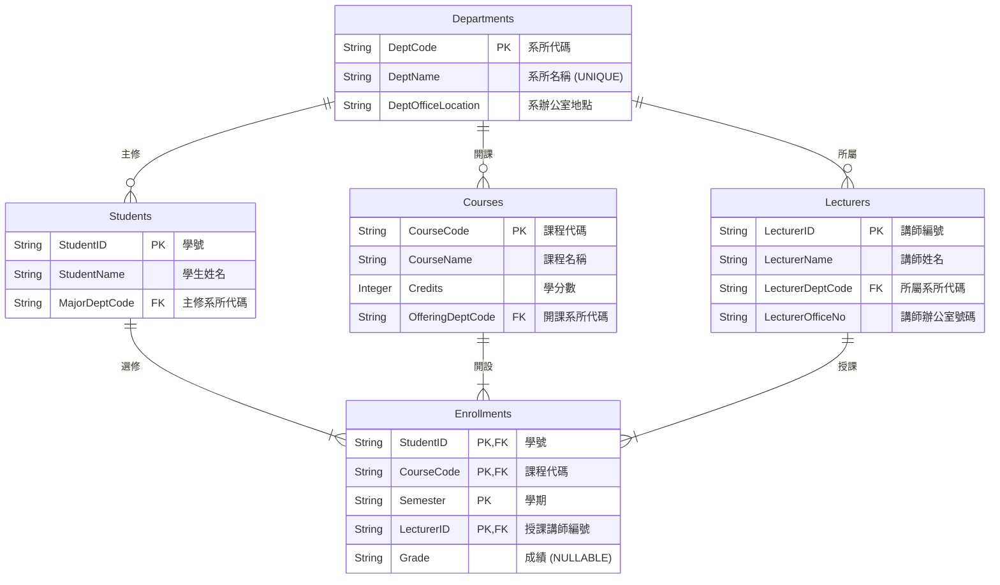

**`Lab-05_3_readme.md`**

````markdown
## GAI 工具使用說明及操作過程

**操作過程概述：**

1.  **情境理解與需求分析(Input Analysis)**：向 GAI 工具提供每個 Lab 的情境描述、原始資料欄位以及具體任務要求。
2.  **初步資料審查(Initial Data Review)**：GAI 分析原始資料，找出潛在的重複、多值屬性等問題。
3.  **函數相依性推導(Functional Dependency Derivation)**：GAI 基於資料屬性間的語義關係，列出所有合理的函數相依性。
4.  **正規化執行(Normalization Execution)**：
    - **UNF -> 1NF**：GAI 協助識別並消除多值屬性與重複群組，確保欄位原子性，並建立必要的關聯資料表。
    - **1NF -> 2NF**：GAI 協助檢查是否存在部分相依性(尤其在有複合主鍵的情況下)，並進行分解。
    - **2NF -> 3NF**：GAI 協助識別並消除遞移相依性，將非鍵屬性間的相依關係分解到新的資料表中。
    - **3NF -> BCNF**：GAI 協助檢查每個決定因素是否為候選鍵，以達到 BCNF。若有衝突或過度分解的疑慮，則進行討論。
5.  **綱要設計與 ERD 概念生成(Schema Design & ERD Conception)**：GAI 根據正規化結果，產生最終的資料表綱要，並描述實體關係圖(ERD)的結構與關係。ERD 圖使用 Mermaid 語法繪製。
6.  **SQL DDL 語句生成 (SQL DDL Generation)**：針對 Lab-05_3，GAI 根據最終綱要產生 MariaDB 的 `CREATE TABLE` 語句。 (此步驟在此 Lab 中不適用或已移除)
7.  **分析與解釋撰寫 (Analysis and Explanation Writing)**：GAI 協助整理正規化過程的每個步驟、理由、遇到的挑戰及設計決策，形成文字說明。

### 初始資料範疇

- **學生**: 學號、學生姓名、主修科系名稱、主修科系辦公室地點。
- **課程**: 課程代碼、課程名稱、學分數、開課系所代碼、開課系所名稱。
- **講師**: 講師編號、講師姓名、講師所屬系所代碼、講師所屬系所名稱、講師辦公室號碼。
- **選課記錄**: 學號、學生姓名、課程代碼、課程名稱、學期、授課講師編號、授課講師姓名、成績。

### 核心假設

- 一位講師可能教授多門課程，一門課程也可能由多位講師講授（例如，不同班級或共同授課）。
- 學生選修特定學期的特定課程，由特定講師授課。

---

## 函數相依性分析

1.  **學生相關**:

    - `學號` → `學生姓名`, `主修科系名稱`, `主修科系辦公室地點`
    - `主修科系名稱` → `主修科系辦公室地點` (遞移)

2.  **課程相關**:

    - `課程代碼` → `課程名稱`, `學分數`, `開課系所代碼`, `開課系所名稱`
    - `開課系所代碼` → `開課系所名稱` (遞移)

3.  **講師相關**:

    - `講師編號` → `講師姓名`, `講師所屬系所代碼`, `講師所屬系所名稱`, `講師辦公室號碼`
    - `講師所屬系所代碼` → `講師所屬系所名稱` (遞移)

4.  **選課記錄相關 (基於假設)**:

    - (`學號`, `課程代碼`, `學期`, `授課講師編號`) → `成績`
    - (原始選課記錄中的 `學生姓名`, `課程名稱`, `授課講師姓名` 為多餘資訊，將在正規化過程中消除)

5.  **科系/系所相關 (從上述遞移相依中提取)**:
    - `系所代碼` → `系所名稱`, `系辦公室地點` (假設系所代碼決定名稱和地點)

---

## 正規化步驟 (至 BCNF)

### Step 0: 原始扁平化資料 (概念)

我們從一個包含所有學生、課程、講師及選課資訊的單一、未正規化表格開始。

- `University_Data (UNF)`: `學號`, `學生姓名`, `主修科系名稱`, `主修科系辦公室地點`, `課程代碼`, `課程名稱`, `學分數`, `開課系所代碼`, `開課系所名稱`, `講師編號`, `講師姓名`, `講師所屬系所代碼`, `講師所屬系所名稱`, `講師辦公室號碼`, `學期`, `成績`

### Step 1: 轉換至 1NF (消除重複群組與確保原子性)

將重複的學生、課程、講師資訊分解，確保每個欄位都是原子性的。

- **`Students_1NF`**: `學號` (PK), `學生姓名`, `主修科系名稱`, `主修科系辦公室地點`
  - _FD: `學號` → `學生姓名`, `主修科系名稱`, `主修科系辦公室地點`_
- **`Courses_1NF`**: `課程代碼` (PK), `課程名稱`, `學分數`, `開課系所代碼`, `開課系所名稱`
  - _FD: `課程代碼` → `課程名稱`, `學分數`, `開課系所代碼`, `開課系所名稱`_
- **`Lecturers_1NF`**: `講師編號` (PK), `講師姓名`, `講師所屬系所代碼`, `講師所屬系所名稱`, `講師辦公室號碼`
  - _FD: `講師編號` → `講師姓名`, `講師所屬系所代碼`, `講師辦公室號碼`_
- **`Enrollments_1NF`**: (`學號` (PK), `課程代碼` (PK), `學期` (PK), `授課講師編號` (PK)), `成績`
  - _FD: (`學號`, `課程代碼`, `學期`, `授課講師編號`) → `成績`_

### Step 2: 轉換至 2NF (消除部分相依)

所有非主鍵屬性必須完全函數相依於主鍵。由於 `Enrollments_1NF` 的 `成績` 完全相依於其複合主鍵，且其他表格的主鍵皆為單一屬性，此步驟主要為 3NF 的分解做準備。

- 此階段沒有新的表格產生，主要工作是為 3NF 做準備。

### Step 3: 轉換至 3NF (消除遞移相依)

消除非主鍵屬性對主鍵的遞移相依性。將科系/系所的重複資訊提取到獨立的 `Departments` 表。

- **`科系/系所 (Departments)`**

  - **`系所代碼` (PK)**
  - `系所名稱` (UNIQUE)
  - `系辦公室地點`
  - _FD: `系所代碼` → `系所名稱`, `系辦公室地點`_

- **`學生 (Students)`**

  - **`學號` (PK)**
  - `學生姓名`
  - `主修系所代碼` (FK, References `Departments(系所代碼)`)
  - _FD: `學號` → `學生姓名`, `主修系所代碼`_

- **`課程 (Courses)`**

  - **`課程代碼` (PK)**
  - `課程名稱`
  - `學分數`
  - `開課系所代碼` (FK, References `Departments(系所代碼)`)
  - _FD: `課程代碼` → `課程名稱`, `學分數`, `開課系所代碼`_

- **`講師 (Lecturers)`**

  - **`講師編號` (PK)**
  - `講師姓名`
  - `所屬系所代碼` (FK, References `Departments(系所代碼)`)
  - `講師辦公室號碼`
  - _FD: `講師編號` → `講師姓名`, `所屬系所代碼`, `講師辦公室號碼`_

- **`選課記錄 (Enrollments)`**
  - **`學號` (PK, FK, References `Students(學號)`)**
  - **`課程代碼` (PK, FK, References `Courses(課程代碼)`)**
  - **`學期` (PK)**
  - **`授課講師編號` (PK, FK, References `Lecturers(講師編號)`)**
  - `成績` (NULLABLE)
  - _FD: (`學號`, `課程代碼`, `學期`, `授課講師編號`) → `成績`_

### Step 4: 轉換至 BCNF (每個決定因素都是候選鍵)

檢查每個 3NF 表格，確保所有非平凡函數相依性的決定因素都是該表的超鍵。所有表格都已達到 BCNF。

---

## 最終 BCNF 資料表結構

1.  **`科系/系所 (Departments)`**

    - **`系所代碼` (PK)**
    - `系所名稱` (UNIQUE)
    - `系辦公室地點`

2.  **`學生 (Students)`**

    - **`學號` (PK)**
    - `學生姓名`
    - `主修系所代碼` (FK, References `Departments(系所代碼)`)

3.  **`課程 (Courses)`**

    - **`課程代碼` (PK)**
    - `課程名稱`
    - `學分數`
    - `開課系所代碼` (FK, References `Departments(系所代碼)`)

4.  **`講師 (Lecturers)`**

    - **`講師編號` (PK)**
    - `講師姓名`
    - `所屬系所代碼` (FK, References `Departments(系所代碼)`)
    - `講師辦公室號碼`

5.  **`選課記錄 (Enrollments)`**
    - **`學號` (PK, FK, References `Students(學號)`)**
    - **`課程代碼` (PK, FK, References `Courses(課程代碼)`)**
    - **`學期` (PK)**
    - **`授課講師編號` (PK, FK, References `Lecturers(講師編號)`)**
    - `成績` (NULLABLE)

---

## 最終的實體關係圖 (ERD)


````
